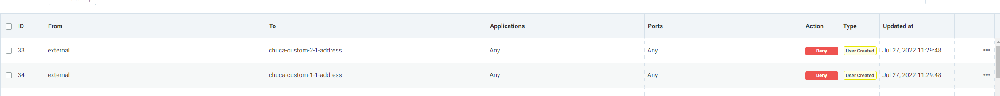

# Protecting Istio-managed Microservices with NeuVector

## Overview

This document describes the feedback of NeuVector test built to protect the ingress traffic to Istio Ingress Controller.

## Testing Environment

1. Deployed Rancher 2.6.6
2. Provisioned a RKE-based downstream kubernetes (v1.22.9) cluster with the following cluster tools deployed.

   * Rancher Monitoring v100.1.2+up19.0.3 (Prometheus/Grafana)
   * Rancher Istio v100.3.0+up1.13.3
   * NeuVector with the following custom built images
     * docker.io/neuvector/controller:eg.1
     * docker.io/neuvector/enforcer:eg.1
     * docker.io/neuvector/manager:eg.1
     * docker.io/neuvector/scanner:latest
     * docker.io/neuvector/updater:latest

### Feedback on Bugs

---

1. Network rule can only control “any” protocol and “any” port instead of “SSL” protocol and “tcp/443” at the moment. 

   Please help raise this to product team as we still expect the granularity of these rules to be down to protocol and port.

2. On the other hand, to my understanding, end-to-end enhancement is done as egress control, is it possible that we can apply end-to-end access control for ingress traffic?

   From my observation, these 2 rules are not effective for controlling traffic coming from browser to target deployments.

3. Abnormal network rules interference between custom group addresses

  The following test cases concern rules #26 and #29. 

I toggled between ALLOW/DENY mode for the above 2 rules, and tried making requests to https://demo-test-2-app-1.home-np-poc2.oocl.com and https://demo-test-1-app-1.home-np-poc2.oocl.com .

However, I observed that seems #26 will also control traffic going to https://demo-test-1-app-1.home-np-poc2.oocl.com.

Supplement security events and curl logs for test2:

#### 

