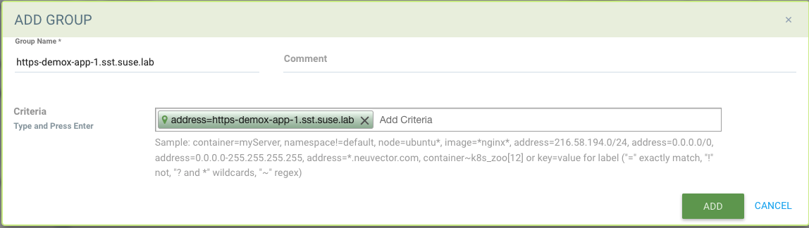
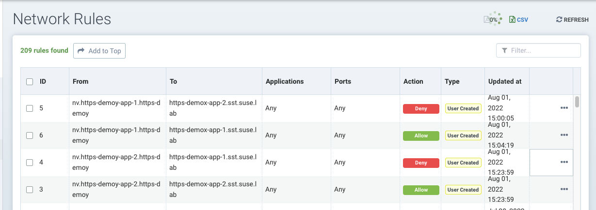
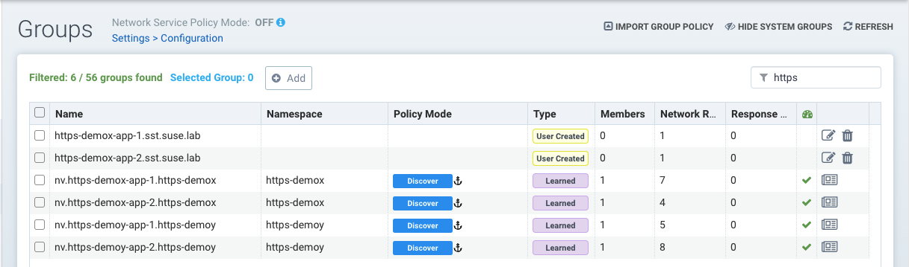
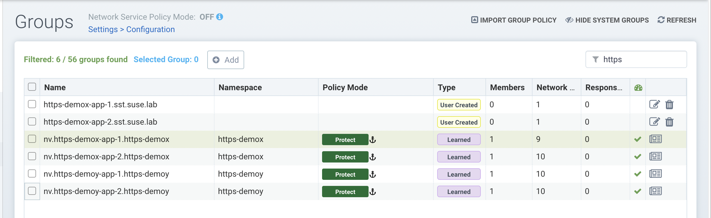
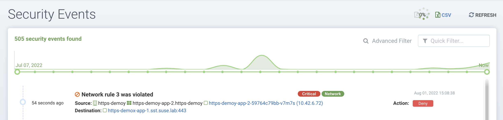
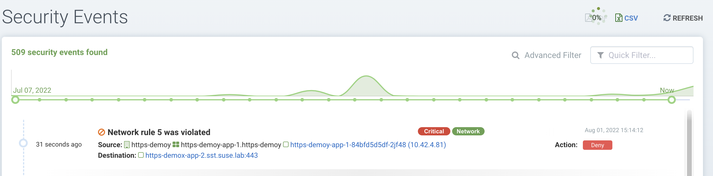

# Protecting Istio-managed Microservices with NeuVector


## Overview

This document describes two specific use cases of NeuVector to protect the ingress traffic to Istio Ingress Controller.


## Testing Environment

1. Deployed Rancher 2.6.6

2. Provisioned a RKE-based downstream kubernetes (v1.22.9) cluster with the following cluster tools deployed.

   * Rancher Monitoring v100.1.2+up19.0.3 (Prometheus/Grafana)
   * Rancher Istio v100.3.0+up1.13.3
   * NeuVector with the following custom built images
     * docker.io/neuvector/controller:eg.1
     * docker.io/neuvector/enforcer:eg.1
     * docker.io/neuvector/manager:eg.1
     * docker.io/neuvector/scanner:latest
     * docker.io/neuvector/updater:latest


3. Testing Host:

   SLES 15 SP3 with kubectl installed and configured to connect to the above RKE cluster

   Check out the testing manifests into the testing host

   ```bash
   git clone https://github.com/akiliuhk/nv_service_mash_testing
   cd nv_service_mash_testing
   ```


## Test Scenarios

1. Wildcard test in service mesh
2. HTTPS test in service mesh


### Scenario 1 - Wildcard test in Service Mesh


#### Step 1 - Create `http-gateway` in the Istio system

```
kubectl create -f manifests/http/istio-one-gw-gfeng.yaml
```

Verify the http-gateway is deployed successfully

```bash
❯ kubectl get gateway -n istio-system
NAME           AGE
http-gateway   2m51s
```


#### Step 2 - Deploy the demo apps into namespace `demox` and `demoy`

```bash
kubectl create -f manifests/http/demox-one-gfeng.yaml
kubectl create -f manifests/http/demoy-one-gfeng.yaml
```

The output would be similar to as follows:

```bash
# kubectl create -f manifests/http/demox-one-gfeng.yaml
namespace/demox created
deployment.apps/demox-app-1 created
deployment.apps/demox-app-2 created
service/demox-app-1-svc created
service/demox-app-2-svc created
virtualservice.networking.istio.io/demox-app-1-vs created
virtualservice.networking.istio.io/demox-app-2-vs created

# kubectl create -f manifests/http/demoy-one-gfeng.yaml
namespace/demoy created
deployment.apps/demoy-app-1 created
deployment.apps/demoy-app-2 created
service/demoy-app-1-svc created
service/demoy-app-2-svc created
virtualservice.networking.istio.io/demoy-app-1-vs created
virtualservice.networking.istio.io/demoy-app-2-vs created
```

Let's verify the deployed resources in namespace `demox`.

```bash
# kubectl get pods,svc -n demox
```

The result would be like below.

```bash
# kubectl get pods,svc -n demox

NAME                               READY   STATUS    RESTARTS   AGE
pod/demox-app-1-8f4c768dd-2b6dv    2/2     Running   0          2d1h
pod/demox-app-2-5cf94fb455-6pl4w   2/2     Running   0          2d1h

NAME                      TYPE           CLUSTER-IP      EXTERNAL-IP    PORT(S)        AGE
service/demox-app-1-svc   LoadBalancer   10.43.155.253   10.201.0.212   80:30182/TCP   2d1h
service/demox-app-2-svc   LoadBalancer   10.43.62.85     10.201.0.213   80:31003/TCP   2d1h
```

Likewise, verify the deployed resource in namespace `demoy`.

```bash
# kubectl get pods,svc -n demoy
```

The result should be similar as below.

```bash
# kubectl get pods,svc -n demoy

NAME                               READY   STATUS    RESTARTS   AGE
pod/demoy-app-1-5dcc54b48f-2n8r4   2/2     Running   0          2d1h
pod/demoy-app-2-6db76d46d6-txpbb   2/2     Running   0          2d1h

NAME                      TYPE           CLUSTER-IP      EXTERNAL-IP    PORT(S)        AGE
service/demoy-app-1-svc   LoadBalancer   10.43.197.53    10.201.0.210   80:31317/TCP   2d1h
service/demoy-app-2-svc   LoadBalancer   10.43.144.240   10.201.0.211   80:31526/TCP   2d1h
```


#### Step 3 - Define Virtual Service and Service Entry


Create Service Entry

```bash
# kubectl create -f manifests/http/istio-one-se-gfeng.yaml
serviceentry.networking.istio.io/http-route created
```


Check the service entry definition

```bash
# kubectl get se -n istio-system

NAME         HOSTS                LOCATION        RESOLUTION   AGE
http-route   ["*.sst.suse.lab"]   MESH_INTERNAL   DNS          42h
```


Check the virtual services in `demox` and `demoy` namespace.

```bash
# kubectl get vs -n demox

NAME             GATEWAYS                        HOSTS                          AGE
demox-app-1-vs   ["istio-system/http-gateway"]   ["demox-app-1.sst.suse.lab"]   2d1h
demox-app-2-vs   ["mesh"]                        ["demox-app-2.sst.suse.lab"]   2d1h
```


```bash
# kubectl get vs -n demoy

NAME             GATEWAYS                        HOSTS                          AGE
demoy-app-1-vs   ["istio-system/http-gateway"]   ["demoy-app-1.sst.suse.lab"]   2d1h
demoy-app-2-vs   ["mesh"]                        ["demoy-app-2.sst.suse.lab"]   2d1h
```


#### Step 4 - Create custom-group which has wildcard in NeuVector


#### Step 5. Create two network rules

* rule 1: `Allow` traffic from `nv.demoy-app-2.demoy` to custom-group `any.sst.suse.lab`
* rule 2: `Deny` traffic from `nv.demoy-app-1.demoy` to custom-group `any.sst.suse.lab`


#### Step 6. Simulate the allowed network traffic within the application

Let's simulate all the allowed network traffic while the policy is in Discover mode.


Now, connect to the shell of `demoy-app-2` pod and try to visit any FQDN with `*.sst.suse.lab` which is an allowed traffic.

List out the pods in `demoy` namespace.

```bash
# kubectl get pods -n demoy

NAME                           READY   STATUS    RESTARTS   AGE
demoy-app-1-5dcc54b48f-2n8r4   2/2     Running   0          2d1h
demoy-app-2-6db76d46d6-txpbb   2/2     Running   0          2d1h
```

Connect to the shell of `demoy-app-2` pod

```bash
kubectl exec -ti demoy-app-2-6db76d46d6-txpbb -n demoy -- bash
```

Within the command prompt of the pod connected, run the following `curl` command to visit an allowed FQDN (`*.sst.suse.lab`).

```bash
root@demoy-app-1-5dcc54b48f-2n8r4:/usr/local/apache2# curl demox-app-1.sst.suse.lab
<html><body><h1>It works!</h1></body></html>
```

Likewise, repeat this step for pod `demoy-app-1.sst.suse.lab` 

Finally, turn on Protect mode for all the demox and demoy apps in NeuVector.


#### Step 7. Validate the network rules defined in Step 5

To recap, in step 5, we defined the following rules

* rule 1: `Allow` traffic from `nv.demoy-app-2.demoy` to custom-group `any.sst.suse.lab`
* rule 2: `Deny` traffic from `nv.demoy-app-1.demoy` to custom-group `any.sst.suse.lab`


##### Step 7.1 - Validate network rule 1

NeuVector should allow any traffic visiting to FQDN `*.sst.suse.lab` from the pod `demoy-app-2` .

Let's execute the command below in the `demoy-app-2` pods in `demoy` namespace.

```bash
kubectl exec -ti demoy-app-2-6db76d46d6-txpbb -n demoy -- bash
```

Within the command prompt of the given pod, run the curl command.

```bash
root@demoy-app-2-6db76d46d6-txpbb:/usr/local/apache2# curl demox-app-1.sst.suse.lab
<html><body><h1>It works!</h1></body></html>
```


##### Step 7.2 - Validate network rule 2

NeuVector should block traffic visiting to FQDN `*.sst.suse.lab` from the pod `demoy-app-1`

Let's execute the command below in the `demoy-app-1` pods in `demoy` namespace.

```bash
kubectl exec -ti demoy-app-1-5dcc54b48f-2n8r4 -n demoy -- bash
```

Within the command prompt of the given pod, run the curl command.

```bash
root@demoy-app-1-5dcc54b48f-2n8r4:/usr/local/apache2# curl demox-app-1.sst.suse.lab
curl: (7) Failed to connect to demox-app-1.sst.suse.lab port 80: Connection timed out
```

A security event should have been raised due to the violation of the deny rule.


### Scenario 2 - HTTPS test in service mesh


#### Step 1. Generate client and server certificates and keys

Step 1.1 Create a root certificate and private key to sign the certificates for your services

```
openssl req -x509 -sha256 -nodes -days 365 -newkey rsa:2048 -subj '/O=sst.suse.lab./CN=sst.suse.lab' -keyout sst.suse.lab.key -out sst.suse.lab.crt
```


Step 1.2 Create a certificate and a private key for *.sst.suse.lab

```
openssl req -out *.sst.suse.lab.csr -newkey rsa:2048 -nodes -keyout *.sst.suse.lab.key -subj "/CN=*.sst.suse.lab/O=*.sst.suse.lab"
```


```
openssl x509 -req -sha256 -days 365 -CA sst.suse.lab.crt -CAkey sst.suse.lab.key -set_serial 0 -in *.sst.suse.lab.csr -out *.sst.suse.lab.crt
```


Step 1.3 Create a secret for the ingress gateway

```
kubectl create -n istio-system secret tls https-credential --key=*.sst.suse.lab.key --cert=*.sst.suse.lab.crt
```


##### 

#### Step 2 - Create `https-gateway` in the Istio system

```
kubectl create -f manifests/https/https-istio-one-gw-aliu.yaml
```

Verify the http-gateway is deployed successfully

```bash
❯ kubectl get gateway -n istio-system
NAME            AGE
http-gateway    36d
https-gateway   38h
```


#### Step 3 - Deploy the demo apps into namespace `demox` and `demoy`

```bash
kubectl create -f manifests/https/https-demox-one-aliu.yaml
kubectl create -f manifests/https/https-demoy-one-aliu.yaml
```

The output would be similar to as follows:

```bash
# kubectl create -f manifests/http/demox-one-gfeng.yaml
namespace/https-demox created
deployment.apps/https-demox-app-1 created
deployment.apps/https-demox-app-2 created
service/https-demox-app-1-svc created
service/https-demox-app-2-svc created
virtualservice.networking.istio.io/https-demox-app-1-vs created
virtualservice.networking.istio.io/https-demox-app-2-vs created

# kubectl create -f manifests/http/demoy-one-gfeng.yaml
namespace/https-demoy created
deployment.apps/https-demoy-app-1 created
deployment.apps/https-demoy-app-2 created
service/https-demoy-app-1-svc created
service/https-demoy-app-2-svc created
virtualservice.networking.istio.io/https-demoy-app-1-vs created
virtualservice.networking.istio.io/https-demoy-app-2-vs created
```

Let's verify the deployed resources in namespace `demox`.

```bash
# kubectl get pods,svc -n https-demox
```

The result would be like below.

```bash
# kubectl get pods,svc -n https-demox

NAME                                     READY   STATUS    RESTARTS   AGE
pod/https-demox-app-1-b8458fd4-xkcjh     2/2     Running   0          36s
pod/https-demox-app-2-64b6df457f-ktgfp   2/2     Running   0          36s

NAME                            TYPE           CLUSTER-IP      EXTERNAL-IP    PORT(S)         AGE
service/https-demox-app-1-svc   LoadBalancer   10.43.123.236   10.201.0.214   443:30220/TCP   36s
service/https-demox-app-2-svc   LoadBalancer   10.43.111.27    10.201.0.215   443:30594/TCP   36s
```

Likewise, verify the deployed resource in namespace `demoy`.

```bash
# kubectl get pods,svc -n https-demoy
```

The result should be similar as below.

```bash
# kubectl get pods,svc -n https-demoy

NAME                                     READY   STATUS    RESTARTS   AGE
pod/https-demoy-app-1-7d6c84794f-snckp   2/2     Running   0          48s
pod/https-demoy-app-2-666ff6f77d-kzv5l   2/2     Running   0          48s

NAME                            TYPE           CLUSTER-IP      EXTERNAL-IP    PORT(S)         AGE
service/https-demoy-app-1-svc   LoadBalancer   10.43.68.45     10.201.0.216   443:31280/TCP   48s
service/https-demoy-app-2-svc   LoadBalancer   10.43.232.122   10.201.0.217   443:30677/TCP   48s
```


#### Step 4 - Define Virtual Service and Service Entry


Create Service Entry

```bash
# kubectl create -f manifests/https/https-istio-one-se-aliu.yaml
serviceentry.networking.istio.io/https-route created
```


Check the service entry definition

```bash
# kubectl get se -n istio-system

NAME          HOSTS                LOCATION        RESOLUTION   AGE
http-route    ["*.sst.suse.lab"]   MESH_INTERNAL   DNS          12d
https-route   ["*.sst.suse.lab"]   MESH_INTERNAL   DNS          45s
```


Check the virtual services in `demox` and `demoy` namespace.

```bash
# kubectl get vs -n https-demox

NAME             GATEWAYS                         HOSTS                                AGE
demox-app-1-vs   ["istio-system/https-gateway"]   ["https-demox-app-1.sst.suse.lab"]   8m3s
demox-app-2-vs   ["mesh"]                         ["https-demox-app-2.sst.suse.lab"]   8m3s
```


```bash
# kubectl get vs -n https-demoy

NAME             GATEWAYS                         HOSTS                                AGE
demoy-app-1-vs   ["istio-system/https-gateway"]   ["https-demoy-app-1.sst.suse.lab"]   8m11s
demoy-app-2-vs   ["mesh"]                         ["https-demoy-app-2.sst.suse.lab"]   8m11s
```


#### Step 5 - Create custom-group which has wildcard in NeuVector

Create Custom group with address `https-demox-app-1.sst.suse.lab` and `https-demox-app-2.sst.suse.lab`




#### Step 5. Create two network rules

* rule 1: `Allow` traffic from `nv.https-demoy-app-2.https-demoy` to custom-group `https-demox-app-2.sst.suse.lab`
* rule 2: `Deny` traffic from `nv.https-demoy-app-2.https-demoy` to custom-group `https-demox-app-1.sst.suse.lab`
* rule 3: `Allow` traffic from `nv.https-demoy-app-1.https-demoy` to custom-group `https-demox-app-1.sst.suse.lab`
* rule 4: `Deny` traffic from `nv.https-demoy-app-1.https-demoy` to custom-group `https-demox-app-2.sst.suse.lab`




#### Step 6. Simulate the allowed network traffic within the application

Let's simulate all the allowed network traffic while the policy is in Discover mode.



Now, connect to the shell of `https-demoy-app-2` pod and try to visit FQDN with `https-demox-app-2.sst.suse.lab` which is an allowed traffic.

List out the pods in `demoy` namespace.

```bash
# kubectl get pods -n https-demoy

NAME                                 READY   STATUS    RESTARTS   AGE
https-demoy-app-1-84bfd5d5df-6jdmb   2/2     Running   0          13m
https-demoy-app-2-59764c79bb-tddbr   2/2     Running   0          13m
```

Copy CA certificate to `https-demoy-app-2` pod and `https-demoy-app-1` pod

```
kubectl cp sst.suse.lab.crt -n https-demoy https-demoy-app-2-59764c79bb-tddbr:/usr/local/apache2/
```

```
kubectl cp sst.suse.lab.crt -n https-demoy https-demoy-app-1-84bfd5d5df-6jdmb:/usr/local/apache2/
```


Connect to the shell of `https-demoy-app-2` pod

```bash
kubectl exec -ti https-demoy-app-2-59764c79bb-tddbr -n https-demoy -- bash
```

Within the command prompt of the pod connected, run the following `curl` command to visit an allowed FQDN (`*.sst.suse.lab`).

```bash
root@https-demoy-app-2-59764c79bb-tddbr:/usr/local/apache2# curl --cacert sst.suse.lab.crt https://https-demox-app-2.sst.suse.lab
<html><body><h1>It works!</h1></body></html>
```

Likewise, repeat this step for pod `https-demoy-app-1.sst.suse.lab` 

Finally, turn on Protect mode for all the demox and demoy apps in NeuVector.




#### Step 7. Validate the network rules defined in Step 5

To recap, in step 5, we defined the following rules

* rule 1: `Allow` traffic from `nv.https-demoy-app-2.https-demoy` to custom-group `https-demox-app-2.sst.suse.lab`
* rule 2: `Deny` traffic from `nv.https-demoy-app-2.https-demoy` to custom-group `https-demox-app-1.sst.suse.lab`
* rule 3: `Allow` traffic from `nv.https-demoy-app-1.https-demoy` to custom-group `https-demox-app-1.sst.suse.lab`
* rule 4: `Deny` traffic from `nv.https-demoy-app-1.https-demoy` to custom-group `https-demox-app-2.sst.suse.lab`


##### Step 7.1 - Validate network rule 1

NeuVector should allow  traffic visiting to FQDN `https-demox-app-2.sst.suse.lab` from the pod `https-demoy-app-2` .

Let's execute the command below in the `nv.https-demoy-app-2` pods in `https-demoy` namespace.

```bash
kubectl exec -ti https-demoy-app-2-59764c79bb-tddbr -n https-demoy -- bash
```

Within the command prompt of the given pod, run the curl command.

```bash
root@https-demoy-app-2-59764c79bb-tddbr:/usr/local/apache2# curl --cacert sst.suse.lab.crt https://https-demox-app-2.sst.suse.lab
<html><body><h1>It works!</h1></body></html>
```


##### Step 7.2 - Validate network rule 2

NeuVector should block traffic visiting to FQDN `https-demox-app-2.sst.suse.lab` from the pod `https-demoy-app-2`

Let's execute the command below in the `https-demoy-app-2` pods in `https-demoy-app-2` namespace.

```bash
root@https-demoy-app-2-59764c79bb-tddbr:/usr/local/apache2# curl --cacert sst.suse.lab.crt https://https-demox-app-2.sst.suse.lab
curl: (7) Failed to connect to https-demox-app-1.sst.suse.lab port 443: Connection timed out
```

A security event should have been raised due to the violation of the deny rule.




##### Step 7.3 - Validate network rule 3

NeuVector should allow  traffic visiting to FQDN `https-demox-app-1.sst.suse.lab` from the pod `https-demoy-app-1` .

Let's execute the command below in the `https-demoy-app-1` pods in `https-demoy` namespace.

```bash
kubectl exec -ti https-demoy-app-1-84bfd5d5df-6jdmb -n https-demoy -- bash
```

Within the command prompt of the given pod, run the curl command.

```bash
root@https-demoy-app-1-84bfd5d5df-6jdmb:/usr/local/apache2# curl --cacert sst.suse.lab.crt https://https-demox-app-1.sst.suse.lab
<html><body><h1>It works!</h1></body></html>
```

##### Step 7.4 - Validate network rule 4

NeuVector should block traffic visiting to FQDN `https-demox-app-2.sst.suse.lab` from the pod `https-demoy-app-1`

Let's execute the command below in the `https-demoy-app-1` pods in `https-demoy` namespace.

```bash
root@https-demoy-app-1-84bfd5d5df-6jdmb:/usr/local/apache2# curl --cacert sst.suse.lab.crt https://https-demox-app-2.sst.suse.lab
curl: (7) Failed to connect to https-demox-app-2.sst.suse.lab port 443: Connection timed out
```

A security event should have been raised due to the violation of the deny rule.




