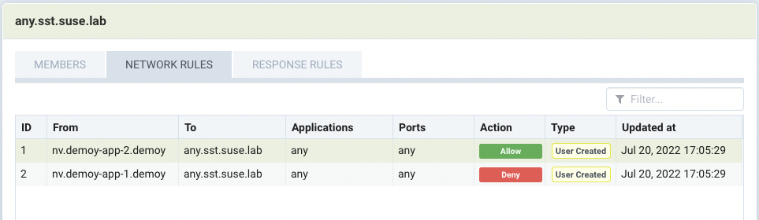
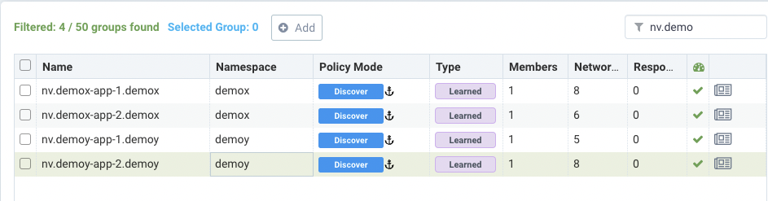

# Protecting Istio-managed Microservices with NeuVector


## Overview

This document describes two specific use cases of NeuVector to protect the ingress traffic to Istio Ingress Controller.


## Testing Environment

1. Deployed Rancher 2.6.6

2. Provisioned a RKE-based downstream kubernetes (v1.22.9) cluster with the following cluster tools deployed.

   * Rancher Monitoring v100.1.2+up19.0.3 (Prometheus/Grafana)
   * Rancher Istio v100.3.0+up1.13.3
   * NeuVector with the following custom built images
     * docker.io/neuvector/controller:eg.1
     * docker.io/neuvector/enforcer:eg.1
     * docker.io/neuvector/manager:eg.1
     * docker.io/neuvector/scanner:latest
     * docker.io/neuvector/updater:latest


3. Testing Host:

   SLES 15 SP3 with kubectl installed and configured to connect to the above RKE cluster

   Check out the testing manifests into the testing host

   ```bash
   git clone https://github.com/dsohk/nv_service_mesh_testing
   
   cd nv_service_mesh_testing
   ```


## Test Scenarios

1. Wildcard test in service mesh
2. HTTPS test in service mesh (To Be Documented)


### Scenario 1 - Wildcard test in Service Mesh


#### Step 1 - Create `http-gateway` in the Istio system

```
kubectl create -f manifests/istio-one-gw-gfeng.yaml
```

Verify the http-gateway is deployed successfully

```bash
❯ kubectl get gateway -n istio-system
NAME           AGE
http-gateway   2m51s
```


#### Step 2 - Deploy the demo apps into namespace `demox` and `demoy`

```bash
kubectl create -f manifests/demox-one-gfeng.yaml
kubectl create -f manifests/demoy-one-gfeng.yaml
```

The output would be similar to as follows:

```bash
# kubectl create -f manifests/demox-one-gfeng.yaml
namespace/demox created
deployment.apps/demox-app-1 created
deployment.apps/demox-app-2 created
service/demox-app-1-svc created
service/demox-app-2-svc created
virtualservice.networking.istio.io/demox-app-1-vs created
virtualservice.networking.istio.io/demox-app-2-vs created

# kubectl create -f manifests/demoy-one-gfeng.yaml
namespace/demoy created
deployment.apps/demoy-app-1 created
deployment.apps/demoy-app-2 created
service/demoy-app-1-svc created
service/demoy-app-2-svc created
virtualservice.networking.istio.io/demoy-app-1-vs created
virtualservice.networking.istio.io/demoy-app-2-vs created
```

Let's verify the deployed resources in namespace `demox`.

```bash
# kubectl get pods,svc -n demox
```

The result would be like below.

```bash
# kubectl get pods,svc -n demox

NAME                               READY   STATUS    RESTARTS   AGE
pod/demox-app-1-8f4c768dd-2b6dv    2/2     Running   0          2d1h
pod/demox-app-2-5cf94fb455-6pl4w   2/2     Running   0          2d1h

NAME                      TYPE           CLUSTER-IP      EXTERNAL-IP    PORT(S)        AGE
service/demox-app-1-svc   LoadBalancer   10.43.155.253   10.201.0.212   80:30182/TCP   2d1h
service/demox-app-2-svc   LoadBalancer   10.43.62.85     10.201.0.213   80:31003/TCP   2d1h
```

Likewise, verify the deployed resource in namespace `demoy`.

```bash
# kubectl get pods,svc -n demoy
```

The result should be similar as below.

```bash
# kubectl get pods,svc -n demoy

NAME                               READY   STATUS    RESTARTS   AGE
pod/demoy-app-1-5dcc54b48f-2n8r4   2/2     Running   0          2d1h
pod/demoy-app-2-6db76d46d6-txpbb   2/2     Running   0          2d1h

NAME                      TYPE           CLUSTER-IP      EXTERNAL-IP    PORT(S)        AGE
service/demoy-app-1-svc   LoadBalancer   10.43.197.53    10.201.0.210   80:31317/TCP   2d1h
service/demoy-app-2-svc   LoadBalancer   10.43.144.240   10.201.0.211   80:31526/TCP   2d1h
```


#### Step 3 - Define Virtual Service and Service Entry


Create Service Entry

```bash
# kubectl create -f istio-one-se-gfeng.yaml
serviceentry.networking.istio.io/http-route created
```


Check the service entry definition

```bash
# kubectl get se -n istio-system

NAME         HOSTS                LOCATION        RESOLUTION   AGE
http-route   ["*.sst.suse.lab"]   MESH_INTERNAL   DNS          42h
```


Check the virtual services in `demox` and `demoy` namespace.

```bash
# kubectl get vs -n demox

NAME             GATEWAYS                        HOSTS                          AGE
demox-app-1-vs   ["istio-system/http-gateway"]   ["demox-app-1.sst.suse.lab"]   2d1h
demox-app-2-vs   ["mesh"]                        ["demox-app-2.sst.suse.lab"]   2d1h
```


```bash
# kubectl get vs -n demoy

NAME             GATEWAYS                        HOSTS                          AGE
demoy-app-1-vs   ["istio-system/http-gateway"]   ["demoy-app-1.sst.suse.lab"]   2d1h
demoy-app-2-vs   ["mesh"]                        ["demoy-app-2.sst.suse.lab"]   2d1h
```


#### Step 4 - Create custom-group which has wildcard in NeuVector


#### Step 5. Create two network rules

* rule 1: `Allow` traffic from `nv.demoy-app-2.demoy` to custom-group `any.sst.suse.lab`
* rule 2: `Deny` traffic from `nv.demoy-app-1.demoy` to custom-group `any.sst.suse.lab`




#### Step 6 - Simulate allowed network traffic in the application can access to demox FQDN name in Discover mode




Here are the pods in `demoy` namespace

```bash
# kubectl get pods -n demoy

NAME                           READY   STATUS    RESTARTS   AGE
demoy-app-1-5dcc54b48f-2n8r4   2/2     Running   0          2d1h
demoy-app-2-6db76d46d6-txpbb   2/2     Running   0          2d1h
```


##### Step 6.1 - Test if `demoy-app-1` can access to `demox-app-1` by hostname.

NeuVector should not blocked any traffic in `demoy-app-1` and `demoy-app-2` .

Let's execute the command below in the `demoy-app-1` pods in `demoy` namespace.

```bash
kubectl exec -ti demoy-app-1-5dcc54b48f-2n8r4 -n demoy -- bash
```

Within the command prompt of the given pod, run the curl command.

```bash
root@demoy-app-1-5dcc54b48f-2n8r4:/usr/local/apache2# curl demox-app-1.sst.suse.lab
<html><body><h1>It works!</h1></body></html>
```


##### Step 6.2 - Test if `demoy-app-2` can access to `demox-app-1` by hostname. 

Let's execute the command below in the `demoy-app-2` pods in `demoy` namespace.

```bash
kubectl exec -ti demoy-app-2-6db76d46d6-txpbb -n demoy -- bash
```

Within the command prompt of the given pod, run the curl command.

```bash
root@demoy-app-2-6db76d46d6-txpbb:/usr/local/apache2# curl demox-app-1.sst.suse.lab
<html><body><h1>It works!</h1></body></html>
```


#### Step 7 - Test if `nv.demoy-app-1` and `nv.demoy-app-2` can access demox FQDN name in Protect mode

now we switch `nv.demoy-app-1` and `nv.demoy-app-2`  to protect mode


##### Step 7.1 - Test if `demoy-app-1` can access to `demox-app-1` by hostname.

NeuVector should have blocked the traffic as a deny rule is defined in the custom group.

Let's execute the command below in the `demoy-app-1` pods in `demoy` namespace.

```bash
kubectl exec -ti demoy-app-1-5dcc54b48f-2n8r4 -n demoy -- bash
```

Within the command prompt of the given pod, run the curl command.

```bash
root@demoy-app-1-5dcc54b48f-2n8r4:/usr/local/apache2# curl demox-app-1.sst.suse.lab
curl: (7) Failed to connect to demox-app-1.sst.suse.lab port 80: Connection timed out
```

A security event should have been raised due to the violation of the deny rule.


##### Step 7.2 - Test if `demoy-app-2` can access to `demox-app-1` by hostname.

NeuVector should have allowed such traffic as an explicit allow rule is defined in the custom group.

Let's execute the command below in the `demoy-app-2` pods in `demoy` namespace.

```bash
kubectl exec -ti demoy-app-2-6db76d46d6-txpbb -n demoy -- bash
```

Within the command prompt of the given pod, run the curl command.

```bash
root@demoy-app-2-6db76d46d6-txpbb:/usr/local/apache2# curl demox-app-1.sst.suse.lab
<html><body><h1>It works!</h1></body></html>
```
